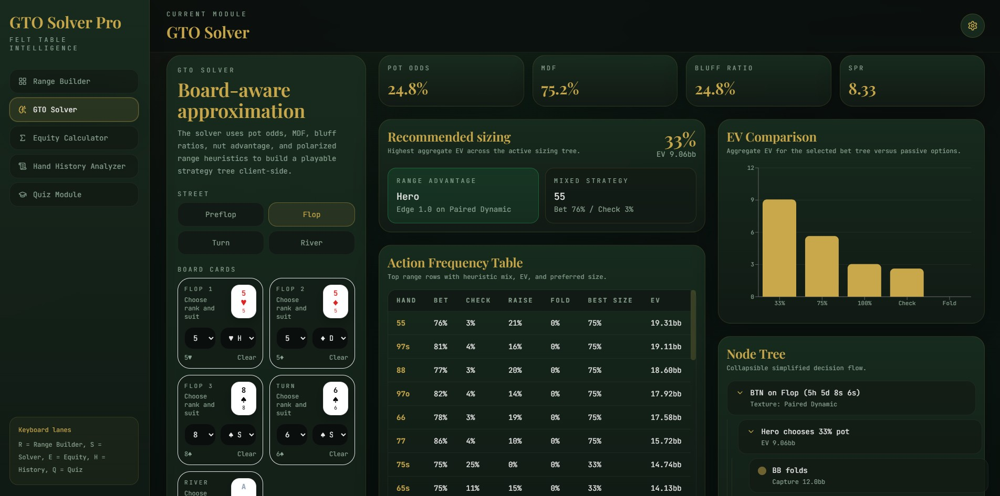
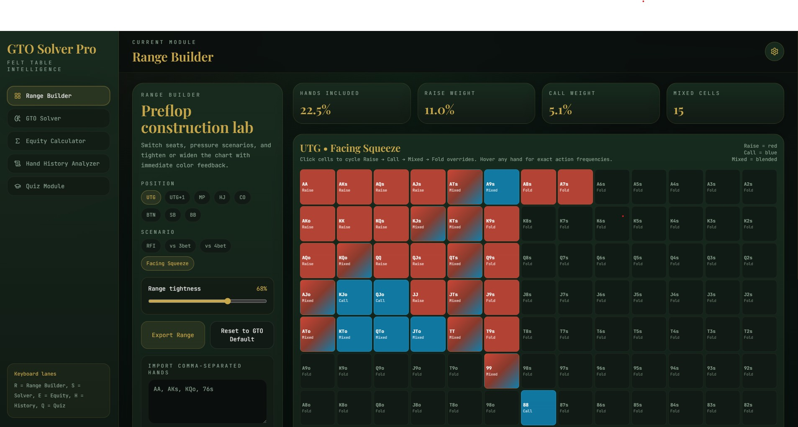

# GTO Solver Pro

Casino-grade Texas Hold'em study workspace built with React, Tailwind CSS, and Recharts.

## Modules

- Range Builder
- GTO Solver
- Equity Calculator
- Hand History Analyzer
- Quiz Module

## Stack

- React 18
- Vite
- Tailwind CSS
- Recharts
- lucide-react

## Local setup

1. Install Node.js 18+.
2. Run `npm install`.
3. Run `npm run dev` for development.
4. Run `npm run build` for a production build.

## Screenshots

Below are two screenshots from the app:

## Notes

- All poker logic runs client-side.
- User quiz stats persist to localStorage.
- The current environment used to generate this scaffold did not have Node installed, so dependency installation and build verification still need to be run locally once Node is available.